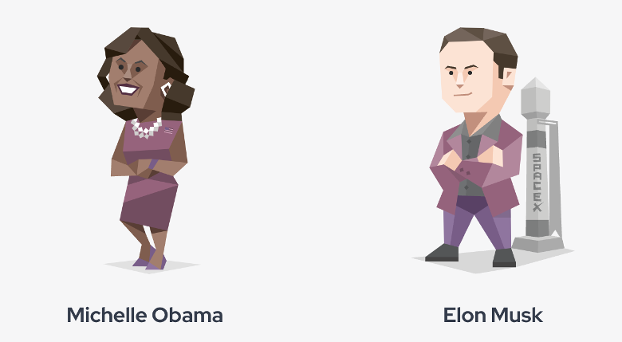

# LLMs_MBTI

## GPT3.5 ENTJ Commander

# Personality Type: ENTJ

## Overview of the ENTJ Personality Type

[ENTJ Personality Type](https://www.16personalities.com/entj-personality)

ENTJs are often seen as natural leaders. They are strategic, goal-oriented, and efficiency-driven. Here are some key characteristics of ENTJs:

- **Leadership and Vision**: ENTJs are known for their ability to create future visions and mobilize others to achieve them.
- **Decisiveness**: They can make quick and confident decisions based on logical reasoning and analysis.
- **Efficiency and Organization**: They value efficiency and effectiveness, often excelling in managerial roles as they can create order and structure.
- **Confidence**: They exude confidence and are often seen as charismatic and persuasive.

## Usage and Cost Details

- **Total Cost**: $0.025 USD

## GPT4.0 INTJ 

  
  
<i>Figure 1: Celebrities with the same MBTI</i>

# Personality Type: INTJ

## Overview of the INTJ Personality Type

[INTJ Personality Type](https://www.16personalities.com/intj-personality)

INTJs are often seen as strategic and visionary thinkers. They are analytical, goal-oriented, and independent. Here are some key characteristics of INTJs:

- **Strategic Planning**: INTJs are known for their ability to see the big picture and develop long-term plans to achieve their goals.
- **Logical Decision Making**: They rely on logical reasoning and objective analysis to make decisions.
- **Independence**: They value independence and often prefer working alone or in small groups where they can focus on their ideas.
- **Confidence and Determination**: They are confident in their abilities and determined to achieve their objectives.

## Usage and Cost Details

- **Total Cost**: $0.025 USD